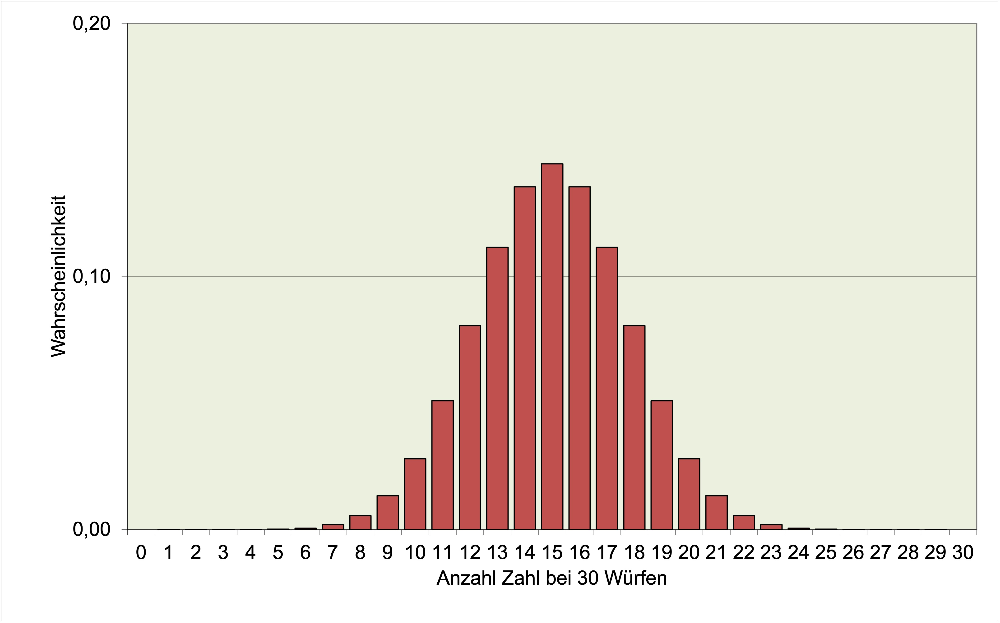
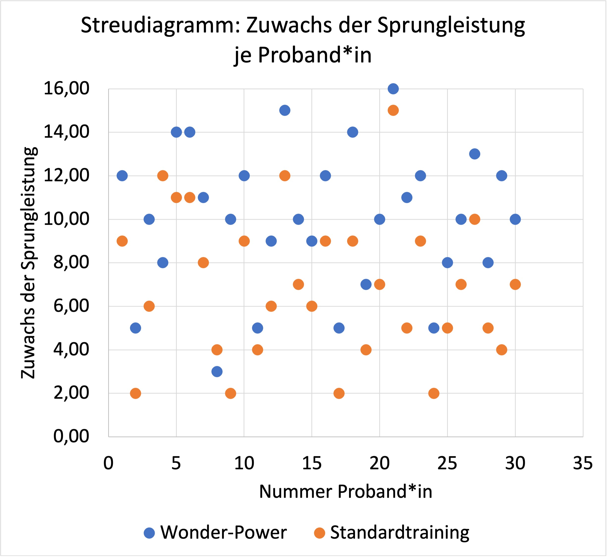
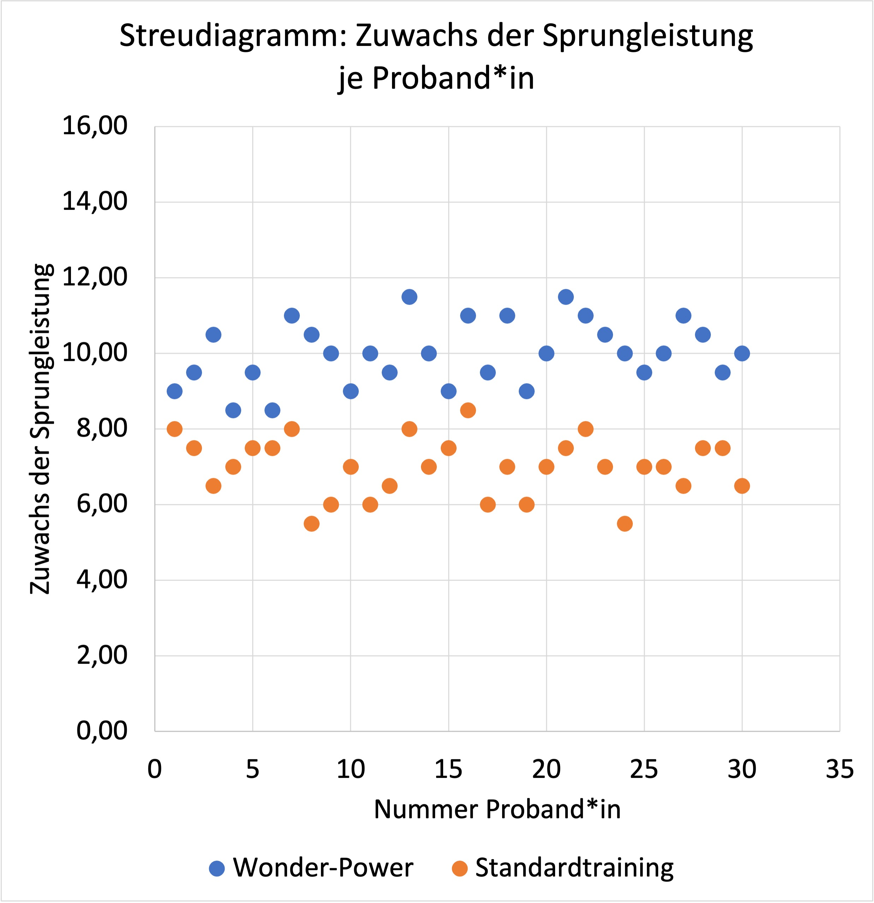
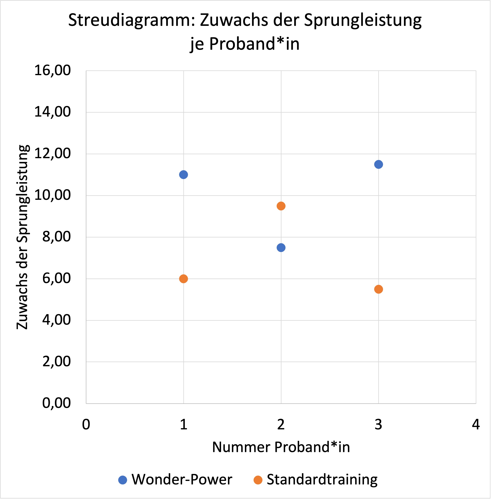
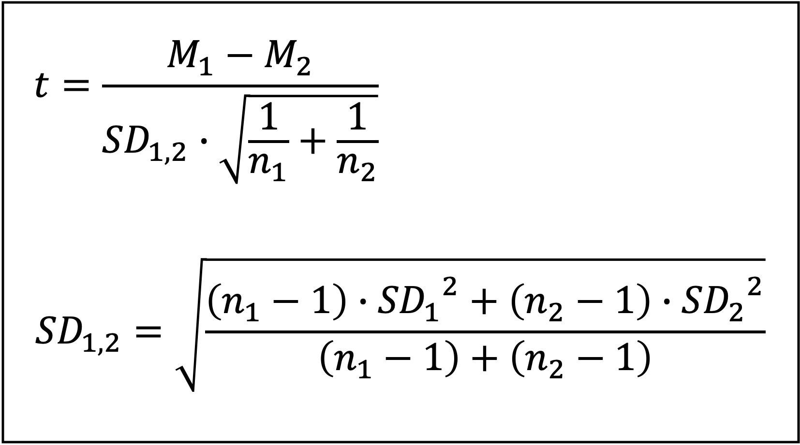

<!--
author: Tim Heemsoth
email: tim.heemsoth@uni-flensburg.de
version: 0.0.1
language: de
narrator: Deutsch Female

import:  https://raw.githubusercontent.com/EUF-SpoWis/Steinbruch/refs/heads/main/config.md
-->

## OER-SportSci Grundlagen und Anwendungsbeispiele

| Parameter                | Kursinformationen                                                                               |
| ------------------------ | ----------------------------------------------------------------------------------------------- |
| **Inhalt:**       | @config.lecture                                                                                 |
| **Datum:**            | @config.semester                                                                                |
| **Hochschule:**          | `Europa-Universität Flensburg`                                                                  |
| **Link auf GitHub:**     | https://raw.githubusercontent.com/EUF-SpoWis/Steinbruch/refs/heads/main/OER-SportSci-Vortrag.md      |
| **Autoren:**             | @author                                                                                         |

> (c) Alle Rechte vorbehalten. 

## Qualitative und quantitative Forschungsmethoden

### Quantitative Verfahren

#### Hyothesen

Was ist eine Hypothese usw... 

**Zur Entscheidung über Hypothesen**

Bei einer Entscheidung für oder gegen eine der Hypothesen können zwei Arten von Fehlern auftreten:

- α-Fehler: H0 wird fälschlicherweise verworfen. 
- β-Fehler: H0 wird fälschlicherweise beibehalten.

Ein α-Fehler liegt etwa vor, wenn eine Trainingsinnovation zur Stärkung des Herzens als hoch wirksam  angenommen wird, obwohl sie es nicht ist. Ein α-Fehler würde also fälschlicherweise zur Ablehnung von H0 und der falschen Unterstützung von H1 führen. 

Ein β-Fehler verhält sich andersrum. Er liegt etwa vor, wenn eine Trainingsinnovation zwar wirksam ist, jedoch H0 beibehalten wird. Ein β-Fehler würde also fälschlicherweise zur Beibehaltung von H0 und der falschen Ablehnung von H1 führen.  

#### Hypothesen testen  
Immer dann, wenn es darum geht, eine Hypothese empirisch zu überprüfen, gilt es, Messergebnisse anhand vereinbarter Kriterien einzuordnen. Dieses Vorgehen soll an folgenden  Beispiele, die zunehmend komplexer werden, erläuter werden.

- Münzwurf - ist die Münze fair? 
- ... 

##### Münzwurf

**Ausgangslage**

Karl hat eine Münze. Er vermutet, dass diese *nicht fair* ist, d. h. er nimmt an: Beim Werfen der Münze ist die Wahrscheinlichkeit, dass das Ergebnis *Zahl* ist, nicht ebenso groß wie die Wahrscheinlichkeit, dass das Ergebnis *Kopf* ist. Seine Annahmen lassen sich wie folgt in Hypothesen überführen:

**Operationalisierte Hypothesen** 

- H0: Die Wahrscheinlichkeit, dass die Münze Zahl zeigt, ist 50 %. 
- H1: Die Wahrscheinlichkeit, dass die Münze Zahl zeigt, ist nicht 50 %. 

**Statistische Hypothesen**

- H0: P("Zahl") = 0,5 
- H1: P("Zahl) ≠ 0,5

**Statistischer Hintergrund**

                          --{{0}}--
Bei einer fairen Münze würde man annehmen, dass bei mehrmaligem Werfen, z. B. 30 Würfen, *Kopf* und *Zahl* annährend gleich häufig vorkommen. Dabei wird man wahrscheinlich nicht exakt eine Gleichverteilug erhalten. In unserem Fall ist also anzunehmen, dass das Ergenis *Zahl* nicht genau 15 lauten wird. Dem *Gesetz der großen Zahl* nach zu folgen wird man jedoch feststellen: 

Wenn man die Aktion "30 mal Werfen" sehr häufig ausführt und stets das Ergebnis von *Anzahl Zahl bei 30 Würfen* in ein Histogramm einträgt, desto stärker nähert sich die Verteilung des Ereignisses *Anzahl Zahl bei 30 Würfen* einer Binomialverteilung mit Mittelwert 15 an. Eine Binomialverteilung zeigt die linke Abbildung. Um etwa zu bestimmen, wie hoch die Wahrscheinlichkeit ist, dass man genau 15 mal Zahl wirft, berechnte man: 
$$
P(\text{15-mal Zahl})
= \binom{30}{15} \cdot 0.5^{15} \cdot 0.5^{30-15}
= 14,45 \%
$$

**Empirisches Vorgehen**

- Karl entscheidet sich: Wenn die Münze weniger als 10 mal Zahl oder mehr als 20 mal Zahl zeigt, ist die Münze nicht fair. D. h. genau dann, wenn beim 30-maligen Werfen das Ergebnis Zahl die Häufigkeit 0, 1, 2, 3, ... 10 oder 20, 21, 22, ...30 hat, würde Karl die Münze als *unfair* bezeichnen. 
- Die Menge dieser Ergebnisse V = \{0, 1, 2, 3, ... 9, 21, 22, 23, 24, ... 30\} bezeichnet man auch als *Verwerfungsbereich*. 
- Mit welcher Wahrscheinlichkeit zeigt eine faire Münze ein Ergebnis, dass in den Verwerfungsbereich fällt?
- Hierfür sind alle Wahrscheinlichkeiten aller Ergebnisse im Verwerfungsbereich aufzusummieren. Die Wahrscheinlichkeit, dass das Ergebis im Verwerfungsbereich liegt, beträgt demnach 4,38 %. 
- Karl wirft 30 mal und erhält 6 mal Zahl. Da das Ergebnis in den Verwerfungsbereich fällt, würde er somit zu einer Wahrscheinlichkeit von 4,38 % einen α-Fehler begehen. 
- Karl entscheidet sich: Zu diesem *Signifikanzniveau* von 4,38 nimmt er die H1 an und lehnt die H0 ab. Die Münze ist für ihn unfair.

##### Trainingsinnovation

**Ausgangslage**

Eine Sportwissenschaftlerin hat eine neue Krafttrainingsmethode "Wonder-Power" erfunden. Sie vermutet, dass *Wonder-Power* die Sprungkraft von Sportler*innen stärker fördert, als ein Standardtraining. Ihre Annahmen lassen sich wie folgt in Hypothesen überführen:  

**Operationalisierte Hypothesen** 

- H0: Sportler\*innen, die nach "Wonder-Power" trainiert haben und Sportler\*innen, die nach einem Standardtraining trainiert haben, unterscheiden sich nicht hinsichtlich der Verbesserung ihrer Sprunghöhe beim Jump and Reach. 
- H1: Sportler\*innen, die nach "Wonder-Power" trainiert haben und Sportler\*innen, die nach einem Standardtraining  trainiert haben, unterscheiden sich hinsichtlich der Verbesserung ihrer Sprunghöhe beim Jump and Reach. 

**Statistische Hypothesen**

- H0: M("Wonder-Power") = M("Standardtraining") 
- H1: M("Wonder-Power") ≠ M("Standardtraining") 

**Statistischer Hintergrund**

Wenn wir Personen in zwei Gruppen aufteilen und bei diesen Merkmale messen (z. B. Verbesserung der Sprunghöhe beim Jum and Reach), dann ist davon auszugehen, dass sich die Gruppen im Mittelwert unterscheiden, hier also nicht exakt die gleichen Ergebnisse vorliegen. In unserem Fall könnte es sein, dass M("Wonder-Power") = 10 cm und M("Standardtraining") = 7 cm. Aber ist der Unterschied von 3 cm ein bedeutsamer Unterschied oder eher zufällig? Um dies bewerten zu können, reichen die Informationen allein über den Mittelwert nicht aus, was an folgenden Beispielen aufgezeigt werden soll (s. Abbildungen).

Text Text Text

Text

Wir brauchen also weitere Informationen 

- Wie viele Personen haben an der Studie teilgenommen?
- Wie groß ist die Streuung der Ergebnisse um den Mittelwert innerhalb der Gruppen?

Mit diesen Informationen können wir einen "standardisierten Mittelwertunterschied" berechnen wie folgt: 

**Empirisches Vorgehen**
@
## Entscheidung über den T-Wert

  <iframe
    scrolling="no"
    title="T-Verteilung"
    src="https://www.geogebra.org/material/iframe/id/nvgjbxj7/width/950/height=558/border/888888/sfsb=true/smb=false/stb=false/stbh=false/ai=false/asb=false/sri=false/rc=false/ld=false/sdz=true/ctl=false"
    width="950"
    height="558"
    style="border:0px;"
    allowfullscreen
    allow="fullscreen">
  </iframe>

<a href="https://www.geogebra.org/m/nvgjbxj7" target="_blank" style="font-weight:bold;"> GeoGebra im Vollbild öffnen</a>

